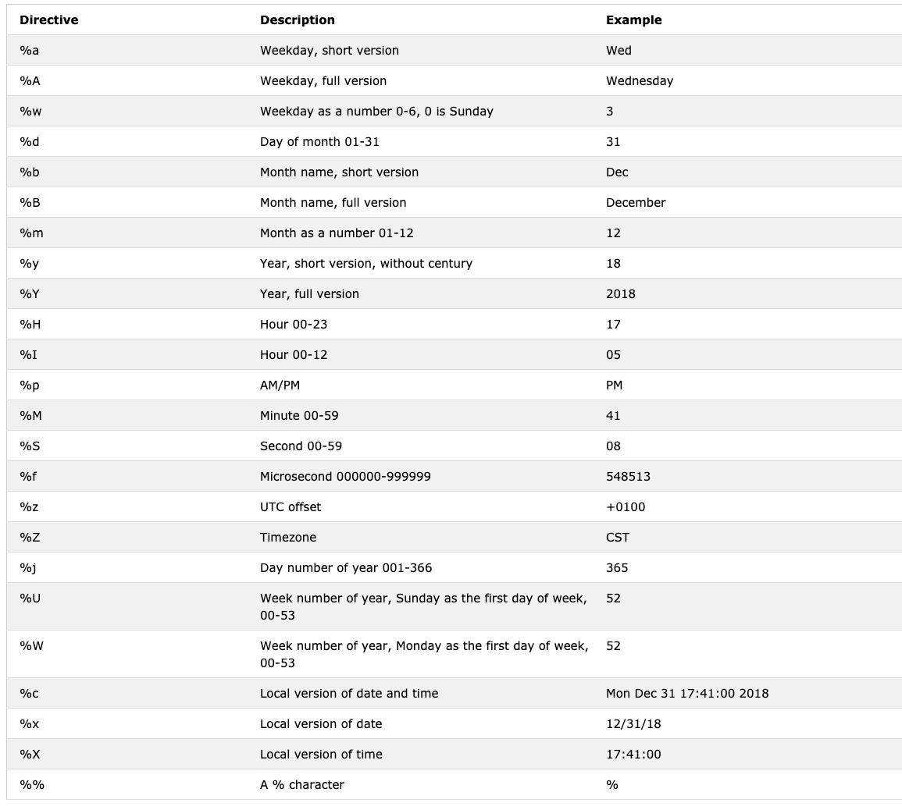

# Python datetime

- Python has a datetime module which handles date and time

```
>>> import datetime
>>> print(dir(datetime))
['MAXYEAR', 'MINYEAR', 'UTC', '__all__', '__builtins__', '__cached__', '__doc__', '__file__', '__loader__', '__name__', '__package__', '__spec__', 'date', 'datetime', 'datetime_CAPI', 'sys', 'time', 'timedelta', 'timezone', 'tzinfo']
```

- *Our focus is date, datetime, time, and timedelta*

## Getting datetime Information

- Here is some cool information we can get with datetime

- Just want to point out that I needed to import the datetime using the from datetime import datetime statement. If not datetime.now() would not work. 
- If you want to import everything: public classes, functions & variables 
from datetime import *

```
>>> import datetime      
>>> now = datetime.now() 
Traceback (most recent call last):
  File "<stdin>", line 1, in <module>
AttributeError: module 'datetime' has no attribute 'now'
>>> from datetime import datetime 
>>> now = datetime.now()
>>> print(now)
2024-10-13 16:10:57.178643
>>> day = now.day
>>> month = now.month 
>>> year = now.year
>>> hour = now.hour
>>> minute = now.minute
>>> second = now.second
>>> timestamp = now.timestamp()
>>> print((day, month, year, hour, minute) 
... )
(13, 10, 2024, 16, 10)
>>> print('timestamp', timestamp)
timestamp 1728850257.178643
>>> print(f'{day}/{month}/{year}, {hour}:{minute}')
13/10/2024, 16:10
```

- *Unix timestamp*: number of seconds that have passed since January 1, 1970 UTC

## Formatting Date Output Using strftime

cheatsheet: https://strftime.org/

```
>>> from datetime import datetime
>>> new_year = datetime(2024, 1, 1)
>>> print(new_year)
2024-01-01 00:00:00
>>> day = new_year.day
>>> month = new_year.month
>>> year = new_year.year
>>> hour = new_year.hour
>>> minute = new_year.minute
>>> second = new_year.second
>>> print(day, month, year, minute)
1 1 2024 0
>>> print(f'{day}/{month}/{year}, {hour}:{minute}')
1/1/2024, 0:0
```

### Using strftime to format time

```
>>> from datetime import datetime 
>>> #current date and time 
>>> now = datetime.now()
>>> t = now.strftime("%H:%M:%S")
>>> print('time:',t)
time: 16:33:04
>>> time_one = now.strftime("%m/%d/%Y, %H:%M:%S")
>>> print("time one:", time_one)
time one: 10/13/2024, 16:33:04
>>> time_two = now.strftime("%d/%m/%Y, %H:%M:%S")
>>> print('time two:', time_two)
time two: 13/10/2024, 16:33:04
```



## String to Time using strptime

The table below shows all the format codes that you can use.

Directive	Meaning	Example
%a	Abbreviated weekday name.	Sun, Mon, ...
%A	Full weekday name.	Sunday, Monday, ...
%w	Weekday as a decimal number.	0, 1, ..., 6
%d	Day of the month as a zero-padded decimal.	01, 02, ..., 31
%-d	Day of the month as a decimal number.	1, 2, ..., 30
%b	Abbreviated month name.	Jan, Feb, ..., Dec
%B	Full month name.	January, February, ...
%m	Month as a zero-padded decimal number.	01, 02, ..., 12
%-m	Month as a decimal number.	1, 2, ..., 12
%y	Year without century as a zero-padded decimal number.	00, 01, ..., 99
%-y	Year without century as a decimal number.	0, 1, ..., 99
%Y	Year with century as a decimal number.	2013, 2019 etc.
%H	Hour (24-hour clock) as a zero-padded decimal number.	00, 01, ..., 23
%-H	Hour (24-hour clock) as a decimal number.	0, 1, ..., 23
%I	Hour (12-hour clock) as a zero-padded decimal number.	01, 02, ..., 12
%-I	Hour (12-hour clock) as a decimal number.	1, 2, ... 12
%p	Locale’s AM or PM.	AM, PM
%M	Minute as a zero-padded decimal number.	00, 01, ..., 59
%-M	Minute as a decimal number.	0, 1, ..., 59
%S	Second as a zero-padded decimal number.	00, 01, ..., 59
%-S	Second as a decimal number.	0, 1, ..., 59
%f	Microsecond as a decimal number, zero-padded on the left.	000000 - 999999
%z	UTC offset in the form +HHMM or -HHMM.	 
%Z	Time zone name.	 
%j	Day of the year as a zero-padded decimal number.	001, 002, ..., 366
%-j	Day of the year as a decimal number.	1, 2, ..., 366
%U	Week number of the year (Sunday as the first day of the week). All days in a new year preceding the first Sunday are considered to be in week 0.	00, 01, ..., 53
%W	Week number of the year (Monday as the first day of the week). All days in a new year preceding the first Monday are considered to be in week 0.	00, 01, ..., 53
%c	Locale’s appropriate date and time representation.	Mon Sep 30 07:06:05 2013
%x	Locale’s appropriate date representation.	09/30/13
%X	Locale’s appropriate time representation.	07:06:05
%%	A literal '%' character.	%


## Using date from datetime


```
>>> from datetime import date
# manually assigning the date to be 1-1-2020, and then assigning as the variable d 
>>> d = date(2020, 1, 1)
>>> print(d)
2020-01-01
#using other methods from the date object? 
>>> print('Current date:', d.today())
Current date: 2025-01-01
>>> #this example is a date object of todays date 
>>> today=date.today()
>>> print("current year:", today.year)
current year: 2025
>>> print("current month:", today.month)
current month: 1
>>> print("current day:", today.day)
current day: 1
```

## Time Objects to Represent Time

## Difference Between Two Points in Time using 

## Difference Between Two Points in Time using timedetlta
