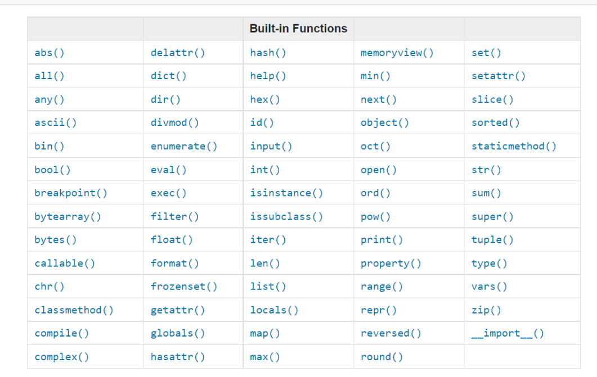
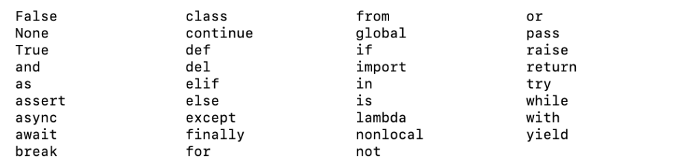

## built in functions

common ones used in python:  print(), len(), type(), int(), float(), str(), input(), list(), dict(), min(), max(), sum(), sorted(), open(), file(), help(), and dir()
-no need to import anything
-more about built in functions: https://docs.python.org/3.9/library/functions.html




Used some of the most common built in functions in a python interactive shell
PS D:\30DaysOfPython> python

```
>>> print('hello world') #prints whatever text value you give it as an argument *takes unlimited arguments*
hello world

>>> len('hello world!') #counts # of characters including spaces
12

>>> type('Hello World') #checks the data type 
<class 'str'>

>>> str(10) #converts number data type to string
'10'

>>> int('10') #converts to number data type
10

>>> float('10') #converts integer to decimal
10.0

>>> input('Enter your gamertag') #asks user for input
Enter your gamertag Willsworld
```
-> Some additional built in functions to keep in mind


->RESERVED KEYWORDS ARE NOT USED WHEN DECLARING VARIABLES OR FUNCTIONS
>>> help('keywords')  
Here is a list of the Python keywords.  Enter any keyword to get more help.

False               class               from                or
None                continue            global              pass
True                def                 if                  raise
and                 del                 import              return
as                  elif                in                  try
assert              else                is                  while
async               except              lambda              with
await               finally             nonlocal            yield
break               for                 not

help(str) gave me a big manual of help lol 

```
>>> dir(str) #gives information about the string
['__add__', '__class__', '__contains__', '__delattr__', '__dir__', '__doc__', '__eq__', '__format__', '__ge__', '__getattribute__', '__getitem__', '__getnewargs__', '__getstate__', '__gt__', '__hash__', '__init__', '__init_subclass__', '__iter__', '__le__', '__len__', '__lt__', '__mod__', '__mul__', '__ne__', '__new__', '__reduce__', '__reduce_ex__', '__repr__', '__rmod__', '__rmul__', '__setattr__', '__sizeof__', '__str__', '__subclasshook__', 'capitalize', 'casefold', 'center', 'count', 'encode', 'endswith', 'expandtabs', 'find', 'format', 'format_map', 'index', 'isalnum', 'isalpha', 'isascii', 'isdecimal', 'isdigit', 'isidentifier', 'islower', 'isnumeric', 'isprintable', 'isspace', 'istitle', 'isupper', 'join', 'ljust', 'lower', 'lstrip', 'maketrans', 'partition', 'removeprefix', 'removesuffix', 'replace', 'rfind', 'rindex', 'rjust', 'rpartition', 'rsplit', 'rstrip', 'split', 'splitlines', 'startswith', 'strip', 'swapcase', 'title', 'translate', 'upper', 'zfill']
```

->Mathematical operations that are built in functions in python

1. min - gives the minimum value
```
>>> min(20,30,69,74)
20
```
2. max - gives the maximum value
```
>>> max(20,30,69,74) 
74
```

->you could also add some square brackets to both min/max if you want to pass a list to it as your argument for example 
```
>>> min([20,33,40,65]) 
20

>>> max([12,14,15,20])
20
```

3. sum - only takes list as an argument and returns the sum.
```
>>> sum([12,68,45,20]) #the fact that this worked tells me order doesn't matter in lists forsure. 
145
```

# Variables
-----

- vars store data in memory, mnemominc variables are great bc easily remembered/associated
- Number at the beginning, special character, hyphen are not allowed when naming a variable.

## Python Variable Name Rules
- Must start with a letter or the underscore _help character
- Cannot start with a number 1help
- Can only contain alpha-numeric characters and underscores (A-z, 0-9, and _ )
- Case-sensitive (firstname, Firstname, FirstName and FIRSTNAME) are different variables
- (snake_case) variable naming convention

- The = sign in python is an assigmnent operator, so when we set a variable equal to a certain data type through assignment we call that VARIABLE DECLARATION

- You can declare multiple variables in one line in python

```
first_name, last_name, country, age, is_married = 'Asabeneh', 'Yetayeh', 'Helsink', 250, True
first_name, last_name, country, age, is_married = 'Will', 'Rodriguez', 'Miami', 560, False
```

- You could also use user input to for variable declaration

# DATA TYPES

- We can use the type() function to get data types; programming is all about data types so this section is important

## CHECKING DATA TYPES AND CASTING:

```
first_name= 'Will'
last_name= 'Rodriguez' 
country= 'USA' 
age= 350
is_married = False
```

### printing out these data types 

```
>>> print(type('will'))
<class 'str'>
>>> print(type('first_name'))
<class 'str'>
>>>
```

CASTING: Converting one data type from one -> another 
Arithemtic operations on strings conver tthem to ints or floats or they return an error (makes sense word + number go boom pow)
When you concatenate a number with a string, number should first convert into a string

### int to float

```
num_int = 10
print('num_int',num_int)         # 10
num_float = float(num_int)
print('num_float:', num_float)   # 10.0
```

### float to int

```
gravity = 9.81
print(int(gravity))             # 9
```

### int to str

```
num_int = 10
print(num_int)                  # 10
num_str = str(num_int)
print(num_str)                  # '10'
```

### str to int or float

```
num_str = '10.6'
print('num_int', int(num_str))      # 10
print('num_float', float(num_str))  # 10.6
```

### str to list

```
first_name = 'Asabeneh'
print(first_name)               # 'Asabeneh'
first_name_to_list = list(first_name)
print(first_name_to_list)            # ['A', 's', 'a', 'b', 'e', 'n', 'e', 'h']
```

# Numbers
## Number data types in Python:

Integers: Integer(negative, zero and positive) numbers Example: ... -3, -2, -1, 0, 1, 2, 3 ...

Floating Point Numbers(Decimal numbers) Example: ... -3.5, -2.25, -1.0, 0.0, 1.1, 2.2, 3.5 ...

Complex Numbers Example: 1 + j, 2 + 4j, 1 - 1j

