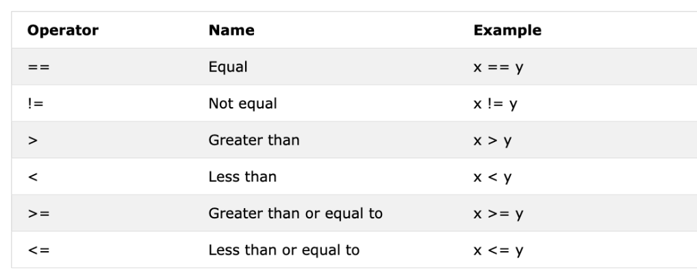

#Day 3

##Boolean
- Boolean is a data type that represents true or false. (T/F need to be capitalized)
- This data type becomes more relevant when we start using comparison operators

print(True)
print(False)

##operators

assignment operator - storing a value in a variable

arithmetic operators
--------------------
addition + a+b
subtraction - a-b
Multiplication * a*b 
Division / a/b
Modulus a%b
Floor division // a//b
exponent ** a**b

Arithmetic operations with integers examples:
----------------------------------------------
>>> print('Addition: ', 1+6)
Addition:  7
>>> print('Subtraction: ', 69-5) 
Subtraction:  64
>>> print('Multiplication: ', 5*25)
Multiplication:  125
>>> print('Division: ', 25/5) #Division in python gives you a float
Division:  5.0
>>> print('Division without the remainder: ', 7//2) 
Division without the remainder:  3
>>> print('Modulus: ', 3%2)
Modulus:  1
>>> print('Exponent: ',5**5)
Exponent:  3125

Arith Operations with Floats
>>> print('Floating point number, Pi', 3.14)
Floating point number, Pi 3.14
>>> print('Floating point Number, gravity in m/s2', 9.81)
Floating point Number, gravity in m/s2 9.81

Arith Operations with Complex Numbers
Complex numbers are with an j not an i
>>> print('Complex number: ',1 + 1i) 
  File "<stdin>", line 1
    print('Complex number: ',1 + 1i)
                                 ^
SyntaxError: invalid decimal literal
>>> print('Complex number: ',1 + 1j) 
Complex number:  (1+1j)
>>> print('Multiplying complex numbers: ',(1+1j) * (1-1j))
Multiplying complex numbers:  (2+0j)

Declaring variables and assigning them a number data type 

number_one=3 #number_one is the variable name and its an integer data type
>>> number_one=3
>>> number_two=2
>>>
>>> #arithmetic operations assigning results to a variable
>>> total = number_one + number_two
>>> diff = number_one - number_two
>>> division = number_one / number_two
>>> remainder = number_one % number_two 
>>> floor_division = number_one // number_two
>>> exponential = number_one ** number_two
>>>
>>> print(total)
5
>>> print('Number_one - number_two =', diff)
Number_one - number_two = 1
>>> print('a * b =', product)
Traceback (most recent call last):
  File "<stdin>", line 1, in <module>
NameError: name 'product' is not defined
>>> print('division: ', division)  
division:  1.5
>>> print('remainder',remainder) 
remainder 1

if we declare variables and assign them number data types we could extend this thinking to calculate area, volume, density for example) 

##Comparison Operators

either return a true or false so boolean data type 
== equal x==y
!= not equal x!=y
> greater than
< less than 
>= greater than or equal to 
<= lesser than or equal to 

###Comparison Operator examples:
>>> print(3 > 2)
True
>>> print(3 >= 2)
True
>>> print(3<2)
False
>>> print(2 < 3)
True
>>> print(2 <= 3)
True
>>> print(3 == 2)
False
>>> print(3 != 2)
True
>>> print(len('mango')==len('avocado'))
False
>>> print(len('mango')!=len('avocado'))
True
>>> print(len('mango') < len('avocado'))
True
>>> print(len('milk') != len('meat'))
False
>>> print(len('meat')==len('milk'))
True
>>> print(len('tomato') == len('potato'))
True
>>> print(len('python') > len('dragon'))
False

#Comparing something either gives true or false
>>> print('True == True', True == True)
True == True True
>>> print('True == False ', True==False) 
True == False  False
>>> print('False == False', False == False)
False == False True

python also uses
is: returns true if both variables are the same object (x is y)
is not: returns true if both variables are not the same object (x is not y)
in: returns true if queried list contains a certain item (x in y)
not in: returns true if the queried list doesn't have a certain item (x not in y)

examples of is, is not, in, not 
>>> print('1 is 1', 1 is 1)
<stdin>:1: SyntaxWarning: "is" with a literal. Did you mean "=="?
1 is 1 True
>>> print('1 is not 2', 1 is not 2)
<stdin>:1: SyntaxWarning: "is not" with a literal. Did you mean "!="?
1 is not 2 True
>>> print('W in William', W in William)
Traceback (most recent call last):
  File "<stdin>", line 1, in <module>
NameError: name 'W' is not defined
>>> print('W in William','W' in 'William')
W in William True
>>> print('B in Will', 'B' in 'Will')
B in Will False
>>> print('coding' in 'coding for all')
True
>>> print('a in an:', 'a' in 'an')
a in an: True
>>> print('4 is 2 ** 2:', 4 is 2 ** 2)
<stdin>:1: SyntaxWarning: "is" with a literal. Did you mean "=="?
4 is 2 ** 2: True

##logical operators:
python unlike other languages uses and, or, not, for, keywords for logical operators. 
We use logical operators to combine conditional statements

operator :: description :: example
and :: true if both statements are true :: x < 5 & x < 10 
or :: true if one statement is true :: x <5  or x < 4
not: returns false if the result is true :: not (x <5 and x <10)

examples with logical operators:

>>> print(3 > 2 and 4 > 3)
True
>>> print(3 > 2 and 4 < 3)
False
>>> print(3 < 2 and 4 < 3)
False
>>> print('True and True', True and True)
True and True True
>>> print(3 > 2 or 4 > 3)
True
>>> print(3 > 2 or 4 < 3)
True
>>> print(3 < 2 or 4 < 3)
False
>>> print('True or False:', True or False)
True or False: True
>>> print(not 3 > 2)
False
>>> print(not True)
False
>>> print(not not True)
True
>>> print(not not False)
False
